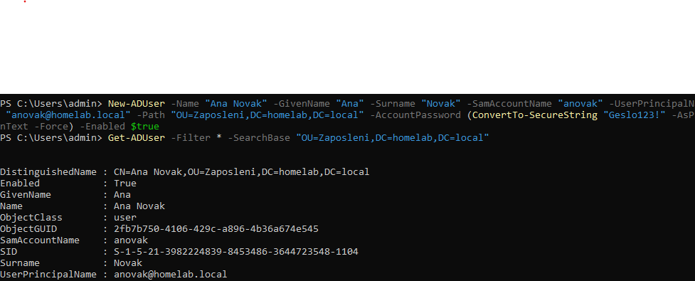

# Ustvarjanje uporabnikov v Active Directory

## Kaj sem naredil

Naredil OU (organizacijsko enoto) "Zaposleni":
```powershell
New-ADOrganizationalUnit -Name "Zaposleni" -Path "DC=homelab,DC=local"
```

Nato ustvaril prvo testno uporabnico:
```powershell
New-ADUser -Name "Ana Novak" -GivenName "Ana" -Surname "Novak" -SamAccountName "anovak" -UserPrincipalName "anovak@homelab.local" -Path "OU=Zaposleni,DC=homelab,DC=local" -AccountPassword (ConvertTo-SecureString "Geslo123!" -AsPlainText -Force) -Enabled $true
```

Preveril da je bla uspešno ustvarjena:
```powershell
Get-ADUser -Filter * -SearchBase "OU=Zaposleni,DC=homelab,DC=local"
```

<details>
<summary>📸 Screenshot</summary>



</details>

## Kaj pomenijo ukazi
- `New-ADOrganizationalUnit` - naredi OU, kot "mapo" za organiziranje uporabnikov
- `New-ADUser` - ustvari novega uporabnika z imenom, uporabniškim imenom (SamAccountName), geslom, in mestom (OU) kamor spada
- `Get-ADUser -Filter *` - pokaže vse uporabnike v določenem OU

## Naučeno
- Kako ustvariti skupino/OU za zaposlene (`New-ADOrganizationalUnit`)
- Kako ustvariti novega uporabnika (`New-ADUser`) - ime, uporabniško ime, geslo, OU
- `Enabled: True` pomeni da je račun trenutno aktiven