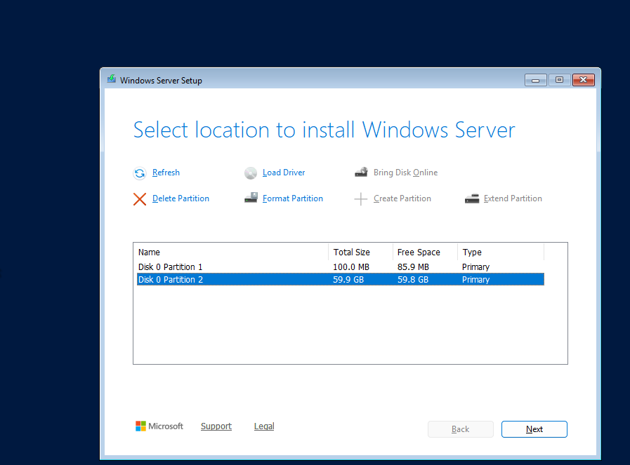
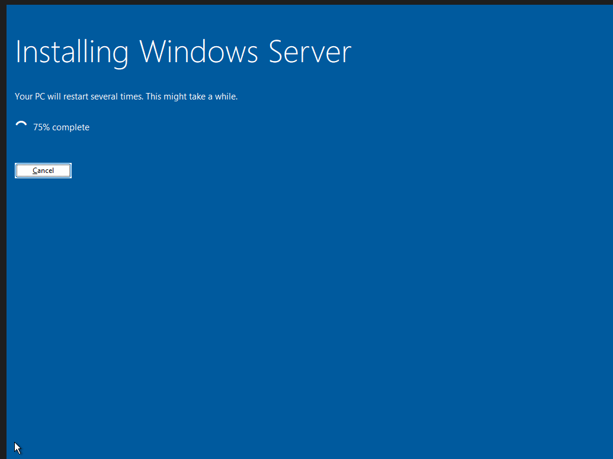

# Inštalacija Windows Serverja na VirtualBox

## Kaj sem naredil

Zagnal sem VM in šel skoz namestitveni čarovnik. Prvi poskus izbire particije mi je javil error, zato sem particijo zbrisal in izbral celoten unallocated space namesto že obstoječe particije - to je popravlo napako.

Nato sem samo počakal da se Windows Server namesti (par minut).

📸 Screenshoti

---

---

## Težave
- Prvi poskus izbire obstoječe particije je javil error "There is an error selecting this partition for install" - rešitev: Delete Partition, nato izbrat unallocated space namesto obstoječe particije

## Naučeno
- Windows Server namestitev je bila precej standardna, podobno kot navaden Windows install.