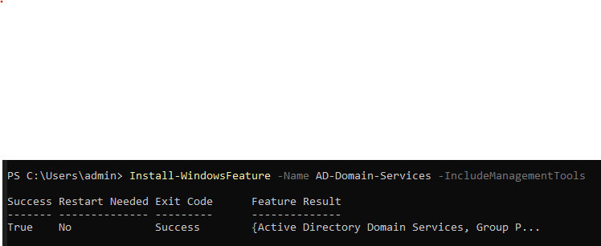
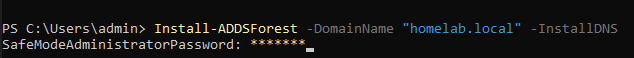
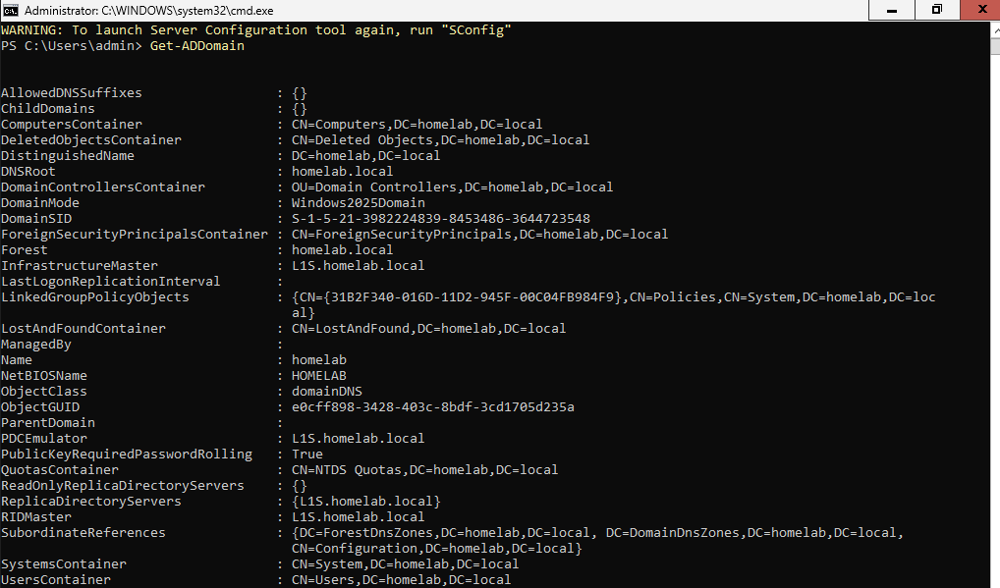
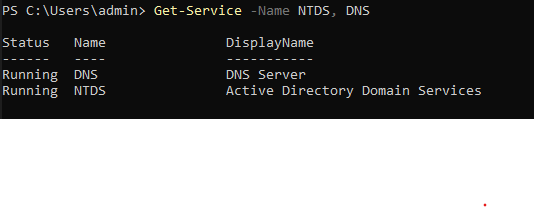

# Namestitev AD Domain Services (AD DS)

## Kaj sem naredil

Namestu AD DS vlogo:
```powershell
Install-WindowsFeature -Name AD-Domain-Services -IncludeManagementTools
```

Povišu strežnik v Domain Controller:
```powershell
Install-ADDSForest -DomainName "homelab.local" -InstallDNS
```

Rabu sem geslo za Safe Mode (velike/male črke, številke, znaki) - prvi poskus je fejlu ker je bilo prešibko.

Po restartu preveru da je vse ok:
```powershell
Get-ADDomain
```

```powershell
Get-Service -Name NTDS, DNS
```

Oba (ADDS, DNS) sta Running - vse dela.

<details>
<summary>📸 Screenshoti</summary>




---


---

---



</details>

## Kaj pomenijo ključni podatki iz Get-ADDomain
- **DNSRoot: homelab.local** - moja domena
- **NetBIOSName: HOMELAB** - kratko ime domene
- **DomainMode: Windows2025Domain** - teče na pravem nivoju
- **Forest: homelab.local** - najvišja organizacijska enota v AD (ker je to prva/edina domena, je hkrati tudi forest)

## Naučeno
- DC rabi static IP + DNS na samega sebe, sicer ADDSForest fejla
- Safe Mode geslo mora bit dost kompleksno