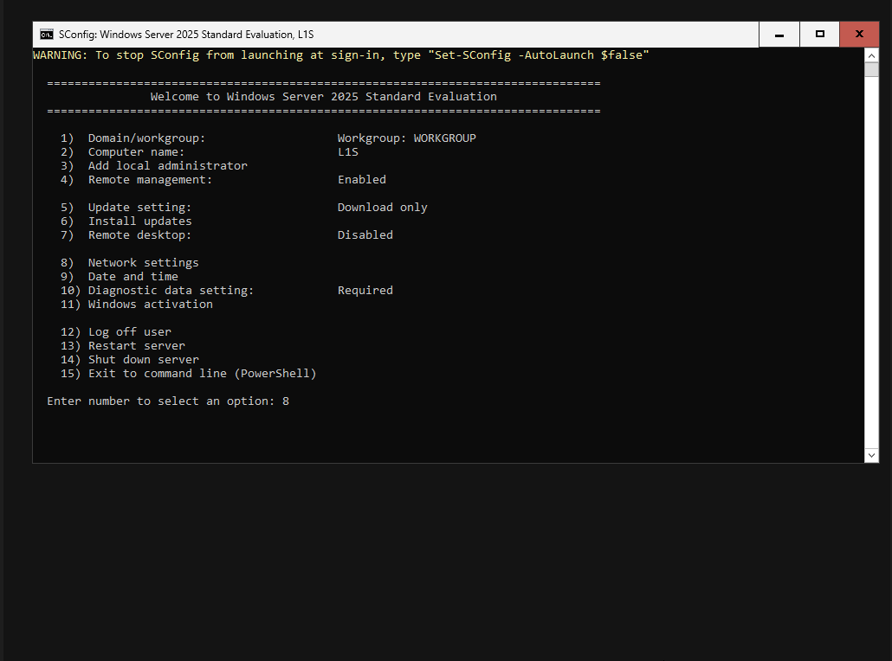
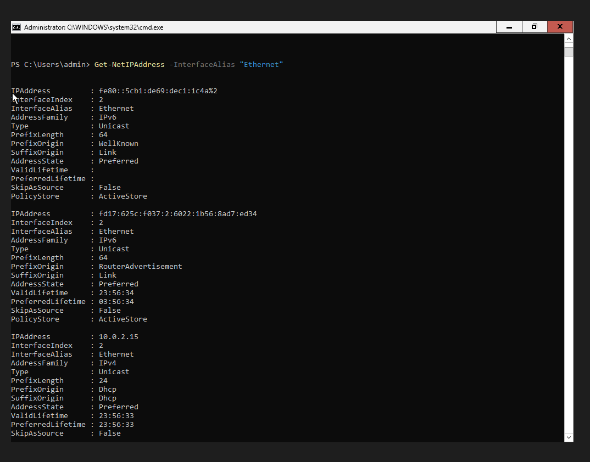
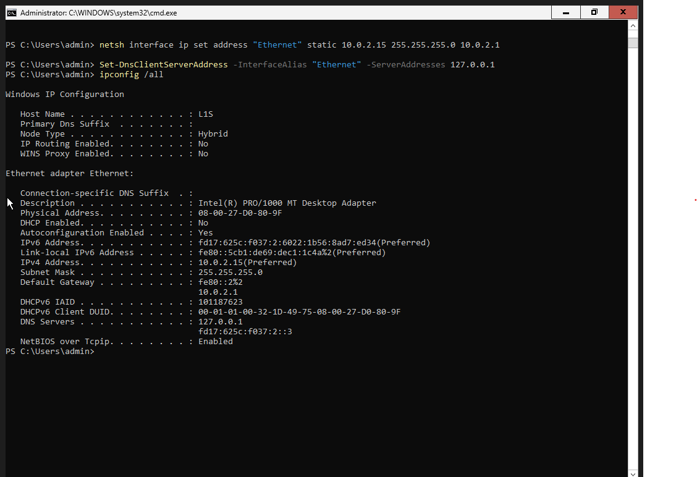

# Nastavitve Windows Serverja v VM-ju

## Kaj sem naredu

Omogočil Remote Desktop (opcija 7 v SConfig meniju), da bom lahko uporablju GUI namesto tega menija.

Nato nastavu static IP in DNS:
```powershell
netsh interface ip set address "Ethernet" static 10.0.2.15 255.255.255.0 10.0.2.1
Set-DnsClientServerAddress -InterfaceAlias "Ethernet" -ServerAddresses 127.0.0.1
```

Preveru z `ipconfig /all` da je vse pravilno nastavljeno.

<details>
<summary>📸 Screenshoti</summary>





</details>

## Kaj pomenijo ukazi
- `Get-NetIPAddress` - pokaže trenutne IP naslove na vmesniku
- `netsh interface ip set address` - zamenja DHCP IP s static, brez da bi ga moru prej ročno zbrisat
- `Set-DnsClientServerAddress` - nastavi DNS na samga sebe (rabu za Domain Controller)

## Kaj sem preveru v ipconfig /all
- **DHCP Enabled: No** - potrdi da je IP zdaj static
- **DNS Servers: 127.0.0.1** - DNS kaže nase
- **IPv4: 10.0.2.15** - moj static IP

## Naučeno
- Domain Controller rabi static IP in DNS na samga sebe, sicer kasnejši `Install-ADDSForest` ne dela pravilno