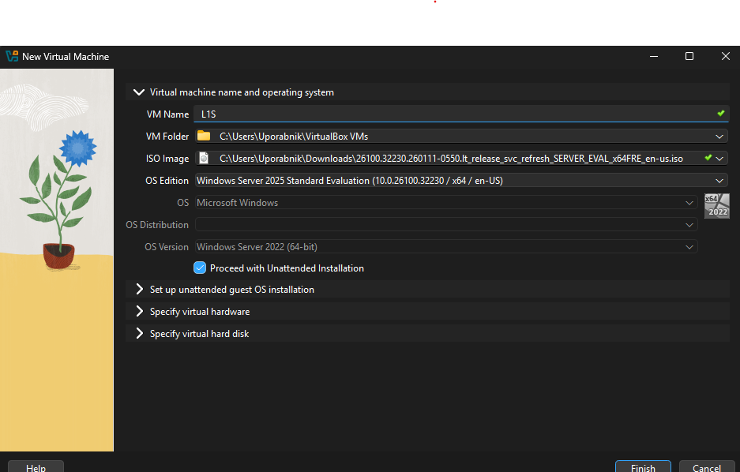
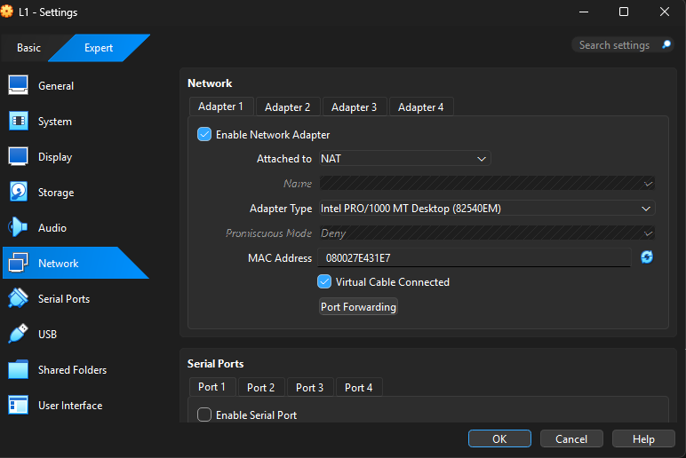

# Priprava virtualnega okolja

## Cilji
- Prenos VirtualBox-a ter Windows Serverja
- Namestitev VirtualBoxa ter Windows Serverja v novem virtualnem okolju

## Postpek
- Prenos [Virtual Box-a](https://www.virtualbox.org/wiki/Downloads)
- Prenos [Windows Server 2025](https://www.microsoft.com/en-us/evalcenter/download-windows-server-2025)
- Inšalacija VMja je bila preprosta in brez težav
---
- Na to sem odprl Oracle VirtualBox Manager -> New -> Dodal svoj ISO, naštimal RAM na 8GB, 4 cpu jedra in virtualni disk v .vdi formatu z 60GB prostora. 
---
- Preveril če je nastavljen NAT pod Settings -> Network.

