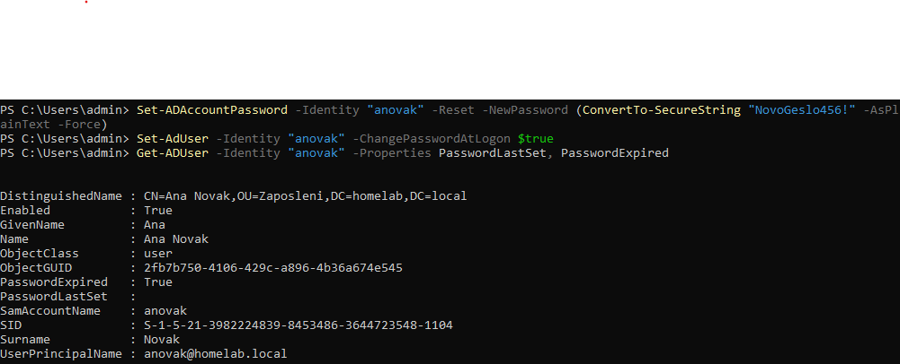

# Tickets

## Ticket #1: Reset gesla

**Problem:** Uporabnica Ana Novak kliče - pozabila je geslo, ne more se prijavit.

**Rešitev:**
```powershell
Set-ADAccountPassword -Identity "anovak" -Reset -NewPassword (ConvertTo-SecureString "NovoGeslo456!" -AsPlainText -Force)
Set-ADUser -Identity "anovak" -ChangePasswordAtLogon $true
```

Nastavil sem začasno geslo in prisilil spremembo ob naslednji prijavi.

**Preverjanje:**
```powershell
Get-ADUser -Identity "anovak" -Properties PasswordLastSet, PasswordExpired
```

`PasswordExpired: True` potrdi da bo uporabnica ob naslednji prijavi morala nastavit novo geslo.

<details>
<summary>📸 Screenshot</summary>



</details>

**Rešeno:** ✅

## Ticket #2: Zaklenjen račun (Account Lockout)

**Problem:** Uporabnica Ana Novak kliče - vpisala je napačno geslo večkrat, zdaj se ne more prijavit tud s pravim geslom.

**Diagnoza:**

Najprej sem preveril privzeto lockout politiko:
```powershell
Get-ADDefaultDomainPasswordPolicy
```

`LockoutThreshold` je bil nastavljen na 0, kar pomeni da je bil lockout **izklopljen** - zato se prej ni dalo simulirat zaklep, ne glede na to kolikokrat sem vpisal napačno geslo.

**Rešitev:**

Najprej sem omogočil lockout politiko:
```powershell
Set-ADDefaultDomainPasswordPolicy -Identity "homelab.local" -LockoutThreshold 3 -LockoutDuration 00:30:00 -LockoutObservationWindow 00:30:00
```

Nato sem simuliral lockout (3x napačno geslo), preveru da je uporabnica dejansko zaklenjena:
```powershell
Get-ADUser -Identity "anovak" -Properties LockedOut
```

In jo odklenil:
```powershell
Unlock-ADAccount -Identity "anovak"
```

**Preverjanje:**
```powershell
Get-ADUser -Identity "anovak" -Properties LockedOut
```

`LockedOut: False` potrdi da je račun spet odklenjen.

<details>
<summary>📸 Screenshoti</summary>


</details>

**Naučeno:** Lockout policy ni privzeto nastavljena na svežem Domain Controllerju - moraš jo ročno konfigurirat, drugače se računi nikoli ne zaklenejo ne glede na št. napačnih poskusov.

**Rešeno:** ✅